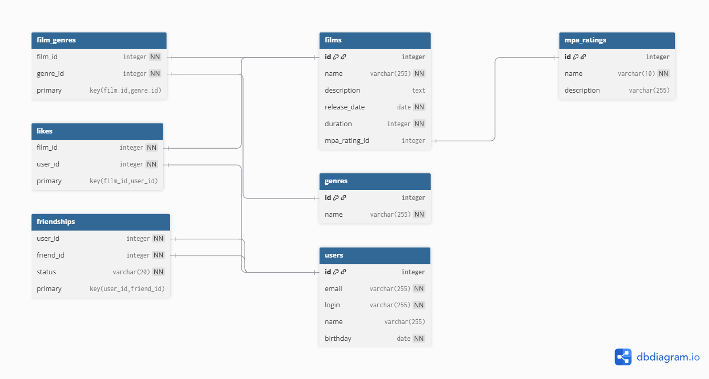

# java-filmorate

Template repository for Filmorate project.

## Схема базы данных



### Описание схемы

База данных содержит следующие таблицы:

- `films` - информация о фильмах
- `users` - данные пользователей
- `genres` - справочник жанров
- `mpa_ratings` - возрастные рейтинги MPA
- `film_genres` - связь фильмов с жанрами (многие-ко-многим)
- `friendships` - связи между пользователями с статусом дружбы
- `likes` - лайки фильмов от пользователей

**Примеры запросов:**
Для фильмов

1. **Получить топ-10 популярных фильмов** (по количеству лайков):
   ```sql
   SELECT f.*, COUNT(l.user_id) AS likes_count
   FROM films f
   LEFT JOIN likes l ON f.id = l.film_id
   GROUP BY f.id
   ORDER BY likes_count DESC
   LIMIT 10;

2. Добавить жанры к фильму:
   ```sql
   INSERT INTO films (name, description, release_date, duration, mpa_rating_id)
   VALUES ('Человек паук', 'Приключения человека пука', '2003-07-16', 90, 3);

3. Найти фильмы по жанру:
   ```sql
   SELECT f.* 
   FROM films f
   JOIN film_genres fg ON f.id = fg.film_id
   WHERE fg.genre_id = 5; -- ID жанра "Боевик"

Операции с пользователями

1. Получить список друзей пользователя:
   ```sql
   SELECT u.*
   FROM users u
   JOIN friendships f ON u.id = f.friend_id
   WHERE f.user_id = 1 AND f.status = 'confirmed';

2. Найти общих друзей двух пользователей:
   ```sql
   SELECT u.*
   FROM users u
   JOIN friendships f ON u.id = f.friend_id
   WHERE f.user_id = 1 AND f.status = 'confirmed';
3. Обновить статус дружбы:
   ```sql
   UPDATE friendships
   SET status = 'confirmed'
   WHERE user_id = 2 AND friend_id = 1;

